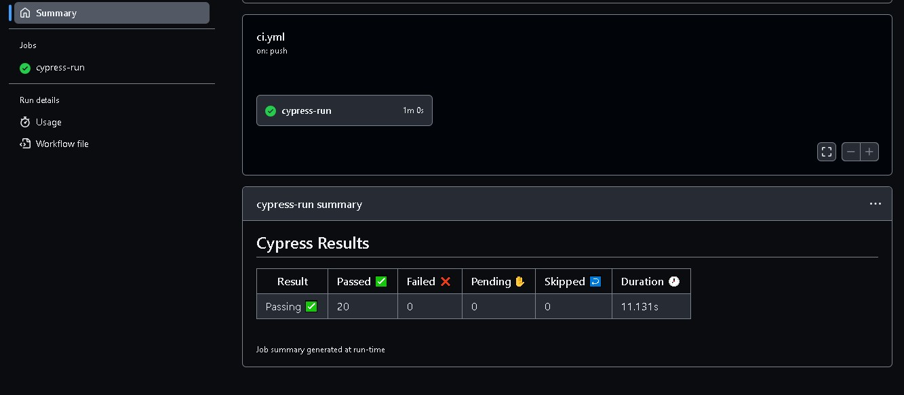

# Testes automatizados com Cypress - Básico
👋 Seja bem-vindo(a)!

## Meus testes passando ❤️❤️❤️

  
  

Nesse curso eu aprimorei meus conhecimentos de cypress, e aproveitei para testar a última versão que no momento é a 13.3. Eu ameiiii❤️

Então, se desejar ver meus testes passando e até sugerir idéias... é necessário ter os seguintes sistemas instalados no seu computador: 

- [git](https://git-scm.com/) (estou usando a versão `2.37.2`)
- [Node.js](https://nodejs.org/en/) (estou usando a versão `v18.16.0`)
- npm (estou usando a versão `9.5.1`)
- [Cypress](https://cypress.io) (estou usando a versão `13.3.`)

> **Obs.:** A recomendação do professor é utilizar as mesmas versões, ou versões mais recentes dos sistemas listados acima.
>
 
O que eu aprendi nesse *curso*:

- Como configurar um projeto Cypress do zero
- Como visitar páginas locais e remotas
- Como lidar com os elementos mais comuns encontrados em aplicações web
- Como testar upload de arquivos
- Como realizar as mais diversas verificações de resultados esperados
- Como criar comandos customizados
- Como lidar com links que abrem em outra aba do navegador
- Como rodar testes simulando as dimensões de um dispositivo móvel
- Como resolver os mesmos problemas de diferentes formas, conhecendo a API do Cypress
- Como executar os testes em um pipeline de integração contínua sempre que mudanças ocorrerem no código da aplicação (ou dos testes)
- Como criar uma documentação mínima para seu projeto de testes automatizados

## Testes

Você pode rodar os testes simulando um desktop ou uma versão viewport mobile. Veja como:

### Desktop

No terminal de comando digite: `npm test` para abrir o cypress no modo  headless

Ou `npm run cy:open` para abrir Cypress no mode interativo 

### Mobile

No terminal de comando digite: `npm run test:mobile` para abrir o cypress no modo  headless

Ou `npm run cy:open:mobile` para abrir Cypress no mode interativo 

### Minha primeira integração continua ❤️

  
  

## Deixe uma estrelinha se gostou dos meus testes ⭐

Este é mais um dos cursos que fiz com o Walmyr Filho da Escola Talking About Testing.